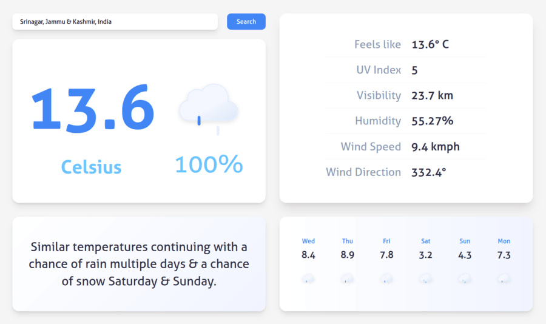

# Weather

A minimal weather info app. This project demonstrates the use of **APIs, Promises, and async/await** for handling asynchronous operations.

## Screenshot

## APIs Used
- Visual Crossing Weather API for weather information
- Nominatim API for location reverse geocoding

## Technologies Used
- JavaScript (ES6+)
- Fetch API
- Promises, Async/Await
- Webpack
- npm
- HTML & CSS

